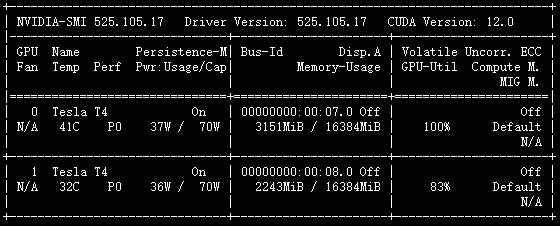
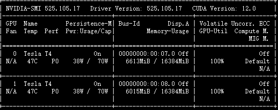
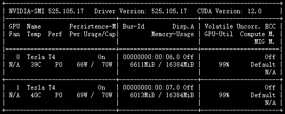
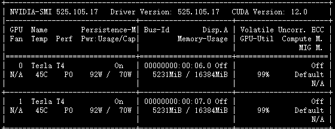
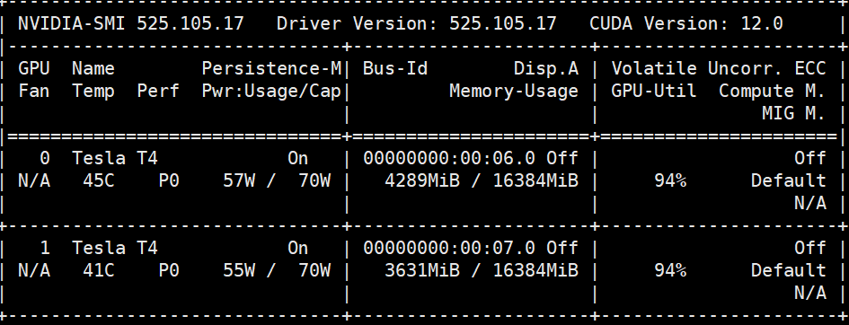

# pytorch-distributed-NLP
pytorch单机多卡分布式训练-中文文本分类。一直想尝试来着，苦于没有卡，只好花过年的压岁钱去Autodl上租了两张卡。

# 环境

```Linux+torch==2.0+transformers==4.28.1```

# 对比

| 方法                         | 耗时(分钟) |
| ---------------------------- | ---------- |
| 单GPU                        | 2.8276     |
| dataparallel                 | 2.0301     |
| distributed                  | 1.4120     |
| distributed-multiprocess     | 1.4921     |
| distributed-multiprocess-amp | 0.6336     |
| horovod                      | 5.1228     |
| deepspeed                    | 1.0114     |
| accelerate                   | 1.3667     |
| transformers-Trainer         | 0.4900     |

# 单GPU训练

运行：```python single-gpu-cls.py```


```python
【train】 epoch：1/1 step：1/288 loss：1.817216
【train】 epoch：1/1 step：2/288 loss：1.850495
【train】 epoch：1/1 step：3/288 loss：1.626242
【train】 epoch：1/1 step：4/288 loss：1.641953
【train】 epoch：1/1 step：5/288 loss：1.678075
```

单GPU没什么好说的。需要一提的是，通常使用```device = torch.device("cuda" if torch.cuda.is_available else "cpu")```将模型和数据放在指定的GPU或者CPU上。

# DataParallel分布式训练

运行：```python multi-gpu-dataparrel-cls.py```

一般流程：

```python
gpu_ids = [0,1]
# 第一步：定义模型
model = BertForSequenceClassification.from_pretrained(args.model_path, config=config)
# 第二步：这里我们不在使用xxx.to(device)这种方式了，直接用xxx.cuda()将模型或者数据放在GPU上。
model.cuda()
# 第三步：nn.DataParallel封装模型，并指定gpu_ids的编码，比如[0,1]使用第1块和第2块GPU,output_device是在那一块GPU上进行汇总计算
model = nn.DataParallel(model, device_ids=args.gpu_ids, output_device=args.gpu_ids[0])
```



```pythn
【train】 epoch：1/1 step：1/288 loss：1.848520
【train】 epoch：1/1 step：2/288 loss：1.912011
【train】 epoch：1/1 step：3/288 loss：1.571108
【train】 epoch：1/1 step：4/288 loss：1.668026
【train】 epoch：1/1 step：5/288 loss：1.558577
```

总的step数并没有减少，但是总占用的GPU显存分布在两张显卡上。

优点：

- 易于使用。

缺点：

- 它使用一个进程来计算模型权重，然后在每个批处理期间将分发到每个GPU，因此通信很快成为一个瓶颈，GPU利用率通常很低。
- 要求所有的GPU都在同一个节点上（不支持分布式）。
- 不能使用[Apex](https://link.zhihu.com/?target=https%3A//nvidia.github.io/apex/amp.html)进行[混合精度训练](https://link.zhihu.com/?target=https%3A//devblogs.nvidia.com/mixed-precision-training-deep-neural-networks/)。

# Distributed分布式训练

运行：

```python
python -m torch.distributed.launch --nnode=1 --node_rank=0 --nproc_per_node=2 --use_env multi-gpu-distributed-cls.py --local_world_size=2

或者

python -m torch.distributed.launch --nnode=1 --node_rank=0 --nproc_per_node=2 multi-gpu-distributed-cls.py --local_world_size=2
```



```python
[5574] Initializing process group with: {'MASTER_ADDR': '127.0.0.1', 'MASTER_PORT': '29500', 'RANK': '0', 'WORLD_SIZE': '2', 'LOCAL_RANK': '0'}
[5575] Initializing process group with: {'MASTER_ADDR': '127.0.0.1', 'MASTER_PORT': '29500', 'RANK': '1', 'WORLD_SIZE': '2', 'LOCAL_RANK': '1'}
[5575] rank = 1, world_size = 2, n = 1, device_ids = [1] 
[5574] rank = 0, world_size = 2, n = 1, device_ids = [0] 

【train】 epoch：1/1 step：1/144 loss：1.765123
【train】 epoch：1/1 step：2/144 loss：1.646639
【train】 epoch：1/1 step：3/144 loss：1.780050
【train】 epoch：1/1 step：4/144 loss：1.642378
【train】 epoch：1/1 step：5/144 loss：1.599494
```

说明：

- nnode：1个节点

- node_rank：节点标识

- nproc_per_node：每个节点2个进程(GPU数目)

- use_env：使用系统的环境变量

- local_world_size：自定义的，GPU的数量

模型会初始化两次，因为起了两个进程，每个进程都需要初始化模型一次。这里说一下rank和local_rank。在单机多卡的情况下rank和local_rank是没有区别的，它标识了当前使用的第几块GPU。

总的step数减少了一半，因为并行处理数据。

在训练的时候进行验证的时候，需要把所有GPU上的结果进行reduce，再进行计算：

```python
def output_reduce(self, outputs, targets):
    output_gather_list = [torch.zeros_like(outputs) for _ in range(self.args.local_world_size)]
    # 把每一个GPU的输出聚合起来
    dist.all_gather(output_gather_list, outputs)

    outputs = torch.cat(output_gather_list, dim=0)
    target_gather_list = [torch.zeros_like(targets) for _ in range(self.args.local_world_size)]
    # 把每一个GPU的输出聚合起来
    dist.all_gather(target_gather_list, targets)
    targets = torch.cat(target_gather_list, dim=0)
    return outputs, targets
```

在加载保存好的模型进行测试的时候，要先将模型进行封装再加载保存好的权重：

```python
model = BertForSequenceClassification.from_pretrained(args.model_path, config=config)
model.cuda()
model = torch.nn.parallel.DistributedDataParallel(model, device_ids=args.device_ids)
model.load_state_dict(torch.load(args.ckpt_path))
```

一般流程：

```python
# 第零步：需要定义一个参数
import argparse
parser = argparse.ArgumentParser()
# ========================================
# 这个必须被预先定义
parser.add_argument("--local-rank", type=int, default=0)
# 第一步：初始化
dist.init_process_group(backend="nccl")
# ========================================
# 第二步：DistributedSampler，需要注意的是在train_loader里面不能再设置shuffle=True
train_dataset = ClsDataset(train_data)
train_sampler = torch.utils.data.distributed.DistributedSampler(train_dataset)
train_loader = DataLoader(train_dataset,
                              batch_size=args.train_batch_size,
                              num_workers=2,
                              collate_fn=collate.collate_fn,
                              sampler=train_sampler)
total_step = len(train_loader) * args.epochs
args.total_step = total_step
dev_dataset = ClsDataset(dev_data)
dev_sampler = torch.utils.data.distributed.DistributedSampler(dev_dataset)
dev_loader = DataLoader(dev_dataset,
                            batch_size=args.dev_batch_size,
                            shuffle=False,
                            num_workers=2,
                            collate_fn=collate.collate_fn,
                            sampler=dev_sampler)
# ========================================
# 第三步：封装模型
self.model = BertForSequenceClassification.from_pretrained(args.model_path,
                                                                   config=self.config)
self.model.cuda()
self.model = torch.nn.parallel.DistributedDataParallel(self.model, device_ids=args.device_ids)
# ========================================
for epoch in range(1, self.args.epochs + 1):
    # 第四步：训练时每一个epoch打乱数据
    train_sampler.set_epoch(epoch)
    for step, batch_data in enumerate(train_loader):
        self.model.train()
        logits, label = self.on_step(batch_data)
        """
        def on_step(self, batch_data):
            # 第五步：根据local_rank将数据分发给指定的GPU
            label = batch_data["label"].cuda()
            input_ids = batch_data["input_ids"].cuda()
            token_type_ids = batch_data["token_type_ids"].cuda()
            attention_mask = batch_data["attention_mask"].cuda()
            output = self.model(input_ids=input_ids,
                                token_type_ids=token_type_ids,
                                attention_mask=attention_mask,
                                labels=label)
            logits = output[1]
            return logits, label
        """
        # ========================================
        loss = self.criterion(logits, label)
        # 第六步：等待所有GPU
        torch.distributed.barrier()
        self.optimizer.zero_grad()
        loss.backward()
        self.optimizer.step()
        # ========================================
        # 第七步：reduce计算损失(汇总所有GPU上的结果)
        loss = self.loss_reduce(loss)
        # ========================================
        # 第八步：在主rank打印指标
        if self.args.local_rank == 0:
            print("【train】 epoch：{}/{} step：{}/{} loss：{:.6f}".format(
                epoch, self.args.epochs, gloabl_step, self.args.total_step, loss
            ))
        # ========================================
        # 第九步：在主rank保存模型
        if gloabl_step % self.args.eval_step == 0:
            loss, accuracy = self.dev(dev_loader)
            if self.args.local_rank == 0:
                print("【dev】 loss：{:.6f} accuracy：{:.4f}".format(loss, accuracy))
                if accuracy > best_acc:
                    best_acc = accuracy
                    print("【best accuracy】 {:.4f}".format(best_acc))
                    torch.save(self.model.state_dict(), self.args.ckpt_path)
# ========================================
# 最后一步
dist.destroy_process_group()
```

# distributed分布式训练-multiprocess启动

运行：```python multi-gpu-distributed-mp-cls.py --local_world_size=2```



```python
【train】 epoch：1/1 step：1/144 loss：1.765123
【train】 epoch：1/1 step：2/144 loss：1.646639
【train】 epoch：1/1 step：3/144 loss：1.780050
【train】 epoch：1/1 step：4/144 loss：1.642378
【train】 epoch：1/1 step：5/144 loss：1.599494
```

说明：

使用时，只需要调用 torch.multiprocessing.spawn，torch.multiprocessing 就会帮助我们自动创建进程。例如有两张显卡，就设置 nprocs=2启动两个进程。

```python
mp.spawn(main_worker, nprocs=2, args=(args,))
```

主函数main_worker里面的第一个参数必须是local_rank，会自动给它赋值。然后我们需要修改：

```python
dist.init_process_group(backend="nccl", init_method="tcp://localhost:12345", world_size=local_world_size, rank=local_rank)
```

由于环境变量里面没有我们所需要的参数了，我们需要自己定义并传入到init_process_group里面。

一般流程：

```python
main_worker(local_rank, args):
    # 除了这里要填入参数外，其余和distributed启动基本一致
    dist.init_process_group(backend="nccl", init_method="tcp://localhost:12345", world_size=local_world_size, rank=local_rank)
if __name__ == "__main__":
    mp.spawn(main_worker, nprocs=2, args=(args,))
```

# AMP混合精度训练

运行：```python multi-gpu-distributed-mp-amp-cls.py --local_world_size=2```

从1.6版本开始，Pytorch原生支持自动混合精度训练，并已进入稳定阶段，



```python
【train】 epoch：1/1 step：1/144 loss：1.799011
【train】 epoch：1/1 step：2/144 loss：1.654877
【train】 epoch：1/1 step：3/144 loss：1.808228
【train】 epoch：1/1 step：4/144 loss：1.615723
【train】 epoch：1/1 step：5/144 loss：1.652313
```

一般流程：

在distributed的基础上，额外添加以下代码即可：

```python
if self.args.use_amp:
    scaler = torch.cuda.amp.GradScaler()
for epoch in range(1, self.args.epochs + 1):
    train_sampler.set_epoch(epoch)
    for step, batch_data in enumerate(train_loader):
        self.model.train()
        if self.args.use_amp:
            with torch.cuda.amp.autocast():
                logits, label = self.on_step(batch_data)
                loss = self.criterion(logits, label)
                torch.distributed.barrier()
                scaler.scale(loss).backward()
                scaler.step(self.optimizer)
                scaler.update()
        else:
            logits, label = self.on_step(batch_data)
            loss = self.criterion(logits, label)
            torch.distributed.barrier()
            loss.backward()
            self.optimizer.step()
```

训练的时长明显变短了，模型的性能也没有下降，非常不错。

# horovod分布式训练

依赖：```horovod==0.27.0```

运行：```horovodrun -np 2 -H localhost:2 python multi-gpu-horovod-cls.py```


```python
[0]<stdout>:【train】 epoch：1/1 step：1/144 loss：1.798987
[0]<stdout>:【train】 epoch：1/1 step：2/144 loss：1.654544
[0]<stdout>:【train】 epoch：1/1 step：3/144 loss：1.808229
[0]<stdout>:【train】 epoch：1/1 step：4/144 loss：1.616281
[0]<stdout>:【train】 epoch：1/1 step：5/144 loss：1.652950
```

一般流程：

```python
hvd.init()
args.local_rank = hvd.local_rank()

torch.cuda.set_device(args.local_rank)

collate = Collate(tokenizer, args.max_seq_len)
train_dataset = ClsDataset(train_data)
train_sampler = torch.utils.data.distributed.DistributedSampler(train_dataset, num_replicas=hvd.size(), rank=hvd.rank())
train_loader = DataLoader(train_dataset,
                          batch_size=args.train_batch_size,
                          num_workers=2,
                          collate_fn=collate.collate_fn,
                          sampler=train_sampler)
total_step = len(train_loader) * args.epochs
args.total_step = total_step
dev_dataset = ClsDataset(dev_data)
dev_sampler = torch.utils.data.distributed.DistributedSampler(dev_dataset, num_replicas=hvd.size(), rank=hvd.rank())
dev_loader = DataLoader(dev_dataset,
                        batch_size=args.dev_batch_size,
                        shuffle=False,
                        num_workers=2,
                        collate_fn=collate.collate_fn,
                        sampler=dev_sampler)

# 这里需要注意，不需要再封装了
model = BertForSequenceClassification.from_pretrained(args.model_path,
                                                          config=config)
model.cuda()
hvd.broadcast_parameters(model.state_dict(), root_rank=0)
optimizer = build_optimizer(model, args)

compression = hvd.Compression.fp16
optimizer = hvd.DistributedOptimizer(
    optimizer,
    named_parameters=model.named_parameters(),
    compression=compression)
hvd.broadcast_optimizer_state(optimizer, root_rank=0)
```

其余的和pytorch自带的distributed差不多，计算loss和ouptput的时候需要注意其定义的方法的区别，具体可参考其文档。但不知为何训练反而变得很慢。

# deepspeed分布式训练

依赖：

```python
pip install deepspeed==0.8.1
sudo apt-get update
sudo apt-get install openmpi-bin libopenmpi-dev
pip install mpi4py
```

运行：```deepspeed --master_port 11222 multi-gpu-deepspeed-cls.py```



```python
【train】 epoch：1/1 step：1/288 loss：1.817383
【train】 epoch：1/1 step：2/288 loss：1.851562
【train】 epoch：1/1 step：3/288 loss：1.679688
【train】 epoch：1/1 step：4/288 loss：1.725586
【train】 epoch：1/1 step：5/288 loss：1.826172
```

如果报错：

- ModuleNotFoundError: No module named 'torch._six：找到报错的文件，

```python
注释掉：from torch._six import string_classes
加入：
int_classes = int
string_classes = str
如果还报错：NameError: name 'inf' is not defined
找到文件中的那一行，
前面加入：
import math
inf = math.inf
```

一般过程：

```python
import torch
import deepspeed

# 初始化DeepSpeed引擎
config = {
    "train_micro_batch_size_per_gpu": 32,
    "optimizer": {
        "type": "Adam",
        "params": {
            "lr": 1e-4
        }
    }
}

model.cuda()
model_engine, optimizer, _, _ = deepspeed.initialize(config_params=config，
                                              model=model,
                                              model_parameters=model.parameters())

# 获取本地rank和设备
local_rank = engine.local_rank
device = engine.device

# 加载数据
train_loader = ...
dev_loader = ...

# 训练循环
for epoch in range(10):
    total_loss = 0.0
    for batch_idx, (data, target) in enumerate(train_loader):
        data, target = data.cuda(), target.cuda()
        # 前向传播和损失计算
        logits = model_engine.forward(data)
        loss = CrossEntropyLoss(data, target)
        # 反向传播和优化器更新
        model_engine.backward(loss)
        model_engine.step()
        ...
```

其余的loss的reduct的output的allgather都可以使用pytorch原生的。

需要注意的是在ZeRO第3阶段，模型被划分到不同的GPU了，要注意保存模型的方式。

测试的时候发现每块GPU对每批数据都进行计算了一次，这里可能需要做些修改，暂时还没找到相关的方法。

```python
              precision    recall  f1-score   support

          其他       0.64      0.66      0.65       546
          喜好       0.49      0.70      0.57       224
          悲伤       0.59      0.52      0.55       228
          厌恶       0.38      0.38      0.38       240
          愤怒       0.56      0.32      0.41       124
          高兴       0.72      0.62      0.67       238

    accuracy                           0.57      1600
   macro avg       0.56      0.53      0.54      1600
weighted avg       0.58      0.57      0.57      1600
```

最后在./output/deepspeed下有一个zero_to_fp32.py文件，我们可以利用将多GPU的模型转换为完整的：

```python
python zero_to_fp32.py /root/pytorch-distributed/output/deepspeed/ ./pytorch_model.bin
```

# accelerate分布式训练

依赖：```pip install accelerate==0.17.1```

运行：

```python
accelerate launch multi-gpu-accelerate-cls.py

或者

python -m torch.distributed.launch --nproc_per_node 2 --use_env multi-gpu-accelerate-cls.py
```


```python
【train】 epoch：1/1 step：1/144 loss：1.795169
【train】 epoch：1/1 step：2/144 loss：1.744665
【train】 epoch：1/1 step：3/144 loss：1.631625
【train】 epoch：1/1 step：4/144 loss：1.543691
【train】 epoch：1/1 step：5/144 loss：1.788955
```

同样的，在进行测试的时候每块GPU都计算了一次数据。

```python
              precision    recall  f1-score   support

          其他       0.64      0.68      0.66       546
          喜好       0.48      0.63      0.55       224
          悲伤       0.62      0.48      0.54       228
          厌恶       0.39      0.53      0.45       240
          愤怒       0.57      0.19      0.29       124
          高兴       0.76      0.56      0.65       238

    accuracy                           0.57      1600
   macro avg       0.58      0.51      0.52      1600
weighted avg       0.59      0.57      0.56      1600
```

一般流程：

```python
train_loader = ...
dev_loader = ...

accelerator = Accelerator()
args.local_rank = int(dist.get_rank())
print(args.local_rank)
model_engine, optimizer_engine, train_loader_engine, dev_loader_engine = accelerator.prepare(
    model, optimizer, train_loader, dev_loader
)
```

其余和distributed基本保持一致。需要注意的是我们也可以使用accelerate自带的一些api操作，需要查看其文档。

# transformers的Trainer分布式训练

运行：```python multi-gpu-transformers-cls.py```


```python
100%|█████████████████████████████████████████████████████████████████████████████████████████████████████| 144/144 [00:49<00:00,  2.92it/s]
100%|███████████████████████████████████████████████████████████████████████████████████████████████████████| 13/13 [00:01<00:00, 10.75it/s]
{'eval_loss': 1.1885839700698853, 'eval_accuracy：': 0.5525, 'eval_runtime': 1.31, 'eval_samples_per_second': 610.67, 'eval_steps_per_second': 9.923, 'epoch': 1.0}

```

一般过程：

```python
def comput_metrics():
    pass

class Collate:
    def __init__():
        pass
    def collate_tn():
        pass
    
train_dtaset = ...
dev_dataset = ...

model = ...

# 定义参数
training_args = TrainingArguments()

# 定义训练器
trainer = Trainer(
	model=model,
    args=training_args,
    train_dataset=train_dtaset,
    eval_dataset=dev_dataset,
    data_collator=collate.collate_fn,
    tokenizer=tokenizer,
    compute_metrics=compute_metrics,
)

trainer.train()

trainer.evaluate()
```

需要注意的是我们直接使用transformers里面的BertForSequenceClassification，如果是自定义的模型，则需要适配考虑输入和输出以及损失函数的计算，这里不作展开。

# 测试和预测

在保存完模型之后，可以使用test.py进行测试，predict.py进行预测，这里展示预测结果：

```python
====================================================================================================
multi_gpu_dataparallel_ckpt_path
文本： 有些th粉真的是无下限加阴魂不散，天天骚扰攻击当，真的懂音乐吗？
真实： 厌恶
预测： 厌恶
====================================================================================================
====================================================================================================
multi_gpu_distributed_ckpt_path
文本： 有些th粉真的是无下限加阴魂不散，天天骚扰攻击当，真的懂音乐吗？
真实： 厌恶
预测： 厌恶
====================================================================================================
====================================================================================================
multi_gpu_distributed_mp_ckpt_path
文本： 有些th粉真的是无下限加阴魂不散，天天骚扰攻击当，真的懂音乐吗？
真实： 厌恶
预测： 厌恶
====================================================================================================
====================================================================================================
multi_gpu_distributed_mp_amp_ckpt_path
文本： 有些th粉真的是无下限加阴魂不散，天天骚扰攻击当，真的懂音乐吗？
真实： 厌恶
预测： 厌恶
====================================================================================================
====================================================================================================
multi_gpu_horovod_ckpt_path
文本： 有些th粉真的是无下限加阴魂不散，天天骚扰攻击当，真的懂音乐吗？
真实： 厌恶
预测： 厌恶
====================================================================================================
====================================================================================================
multi_gpu_deepspeed_ckpt_path
文本： 有些th粉真的是无下限加阴魂不散，天天骚扰攻击当，真的懂音乐吗？
真实： 厌恶
预测： 厌恶
====================================================================================================
====================================================================================================
multi_gpu_accelerate_ckpt_path
文本： 有些th粉真的是无下限加阴魂不散，天天骚扰攻击当，真的懂音乐吗？
真实： 厌恶
预测： 厌恶
====================================================================================================
====================================================================================================
multi_gpu_transformers_ckpt_path
文本： 有些th粉真的是无下限加阴魂不散，天天骚扰攻击当，真的懂音乐吗？
真实： 厌恶
预测： 厌恶
====================================================================================================
```

# 补充

- 不难发现大多情况下基本的流程是差不多的。
- 我们需要一个管家帮我们管理模型、数据、参数等信息怎么分配到不同的GPU上，这个管家可以是原生distributed或者是accelerate、deepspeed。
- 需要注意到底是不同GPU处理相同数据还是不同数据，比如deepspeed、accelerate。
- 以上代码可能只是一个基本的使用，更高级的使用可能还需要自行去查阅相关的资料。
- 还需要注意模型是怎么保存和加载的，一般情况下我们可以使用torch自带的方式来保存和加载模型，但是对于deepspeed中使用的ZeRO3，因为它将模型参数分块到不同的GPU上，因此要使用其带的保存和加载的方法。同时分布式测试的时候，要主要加载模型的时候先用分布式库封装一下（因为我们保存模型的时候是保存了封装之后的模型）。
- 具体占用显存、训练速度、模型性能由于不同参数之间的差异可能稍有出入。
- 如果我们要单独包模型拿出来进行正常的使用，可能需要对模型的参数名进行处理，参考test.py和predict.py里面：

```python
def mapping(checkpoint):
    old_state = torch.load(checkpoint)
    new_state = {}
    for k,v in old_state.items():
        new_state[k.replace("module.", "")] = v
    return new_state
```

# 参考

> [PyTorch分布式训练简明教程(2022更新版) - 知乎 (zhihu.com)](https://zhuanlan.zhihu.com/p/113694038)
>
> [tczhangzhi/pytorch-distributed: A quickstart and benchmark for pytorch distributed training. (github.com)](https://github.com/tczhangzhi/pytorch-distributed)
>
> [Pytorch 分布式训练的坑（use_env, loacl_rank) - 知乎 (zhihu.com)](https://zhuanlan.zhihu.com/p/501632575)
>
> https://pytorch.org/docs/stable/elastic/run.html
>
> https://www.w3cschool.cn/article/76555860.htm
>
> [API — Horovod documentation](https://horovod.readthedocs.io/en/stable/api.html?highlight=allreduce#module-horovod.torch)
>
> [ChatGPT - Poe](https://poe.com/ChatGPT)
>
> [Model Checkpointing — DeepSpeed 0.9.3 documentation](https://deepspeed.readthedocs.io/en/latest/model-checkpointing.html#deepspeed.DeepSpeedEngine.save_checkpoint)
>
> [20分钟吃掉accelerate模型加速工具😋 - 知乎 (zhihu.com)](https://zhuanlan.zhihu.com/p/599274899)
